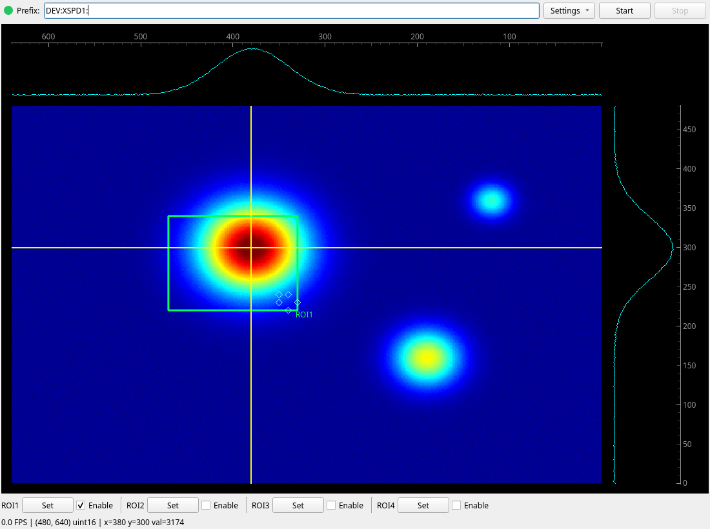

# ntnda-qt-viewer

A lightweight Qt-based live image viewer for EPICS
[NTNDArray](https://docs.epics-controls.org/en/latest/specs/ntndarray.html)
PVs, built on [pyqtgraph](https://pyqtgraph.readthedocs.io/) and
[p4p](https://mdavidsaver.github.io/p4p/).



## Features

- Live streaming from any NTNDArray PVAccess channel
- Decoding of compressed NTNDArray payloads using Python codec libraries
- Supports 8–64 bit signed/unsigned integers and 32/64-bit floats
- Draggable crosshair lines with linked horizontal and vertical pixel profile plots
- Scroll-wheel zoom, right-drag zoom-to-rectangle, double-click to reset
- Bottom ROI controls bar with per-ROI Set button and Enable checkbox
- Set mode initializes ROI from a right-drag rectangle and then auto-exits
- Live pixel readout (x, y, value) under the cursor
- Connection status indicator and framerate display

## Installation

```bash
pip install ntnda-qt-viewer
```

A Qt backend is also required. Install one via the `gui` dependency group or
separately:

```bash
pip install PySide6
```

OR

```bash
pip install ntnda-qt-viewer[pyside6]
```

To support compressed NTNDArray codecs (zlib, blosc, lz4/lz4hdf5, bslz4, jpeg)
install optional codec dependencies:

```bash
pip install "ntnda-qt-viewer[codecs]"
```

## Usage

See the [documentation](docs/index.md) for an annotated walkthrough,
[embedding guide](docs/embedding.md) and [API reference](docs/api/_widget.md).

Launch from the command line with a top-level prefix:

```bash
ntnda-qt-viewer DEV:XSPD1:
ntnda-qt-viewer DEV:XSPD1: --pva-suffix Pva1:
ntnda-qt-viewer DEV:XSPD1: --num-rois 4 --roi-suffix-pattern "ROI{}:"
```

Image PV is formed as `<prefix><pva-suffix>Image`.

ROI PVs are written as `<prefix><roi-suffix>{MinX,MinY,SizeX,SizeY}`.

Or embed the widget in your own Qt application:

```python
from ntnda_qt_viewer import NTNDAViewerWidget

widget = NTNDAViewerWidget(
    prefix="DEV:XSPD1:",
    pva_suffix="Pva1:",
    num_rois=4,
    roi_suffix_pattern="ROI{}:",
)
widget.show()
```

## Development

This project uses [uv](https://astral.sh/uv) for environment management:

```bash
uv sync
uv run --frozen pytest
uv run --frozen ruff check
uv run --frozen ty check
```

## License

BSD 3-Clause. See [LICENSE](LICENSE) for details.
