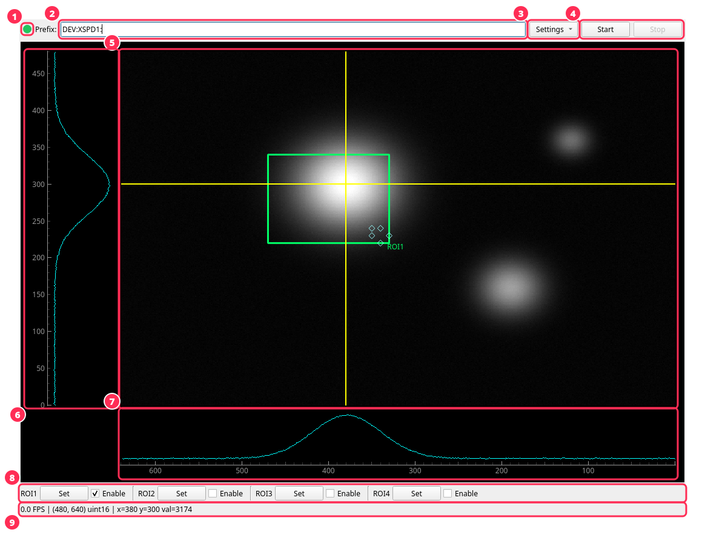
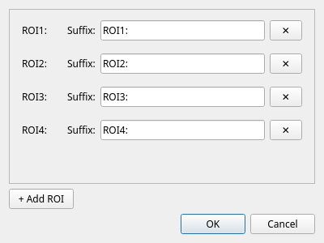
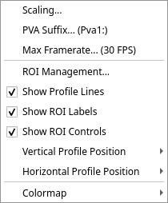
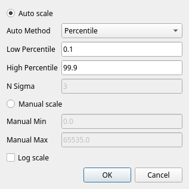

# Usage

## Launching

```bash
ntnda-qt-viewer DEV:XSPD1:                       # image PV DEV:XSPD1:Pva1:Image
ntnda-qt-viewer DEV:XSPD1: --pva-suffix Pva2:    # image PV DEV:XSPD1:Pva2:Image
```

The prefix is required. The image PV is `<prefix><pva-suffix>Image`, and ROI
PVs are `<prefix><roi-suffix>{MinX,MinY,SizeX,SizeY}`.

### Command-line options

| Option | Description |
| --- | --- |
| `prefix` | Top-level PV prefix, or the full array PV with `--raw-waveform`. |
| `--pva-suffix` | PVA plugin suffix (default `Pva1:`). |
| `--num-rois N` | Number of ROIs (default 4). |
| `--roi-suffix-pattern` | Format string for ROI suffixes, given 1..N (default `ROI{}:`). |
| `--raw-waveform` | The PV is a flat array, not an NTNDArray. Requires `--image-shape`. |
| `--image-shape ROWS COLS` | Image size used to reshape a raw waveform. |
| `--color` | The raw waveform is interleaved RGB. |
| `--ca` | Connect to the raw waveform over Channel Access instead of PVAccess. |
| `--scale MIN MAX` | Start in manual scaling over this range. |
| `--log-scale` | Start with log intensity scaling. |
| `--auto-scale {percentile,sigma,minmax}` | Auto scaling method (default `percentile`). |
| `--percentiles LOW HIGH` | Clip percentiles for percentile auto scaling (default `0.1 99.9`). |
| `--n-sigma N` | N for sigma auto scaling: median ± N robust sigma (default 3.0). |

### Plain waveform PVs

For a PV that holds a flat array rather than an NTNDArray, pass the full PV
name and the image size:

```bash
ntnda-qt-viewer DEV:CAM:ArrayData --raw-waveform --image-shape 480 640
ntnda-qt-viewer DEV:CAM:ArrayData --raw-waveform --image-shape 480 640 --color --ca
```

ROI PVs are still built as `<prefix><roi-suffix>...`.

## The window



1. **Connection indicator**: green while frames are arriving, red when
   stopped or disconnected.
2. **Prefix** (or **PV** in raw waveform mode): editable while stopped.
3. **Settings** menu; see [Settings menu](#settings-menu).
4. **Start / Stop**: subscribe to or unsubscribe from the image PV. The
   prefix, PVA suffix and ROI management are locked while running.
5. **Image view** with the crosshair (profile) lines and ROI overlays.
6. **Vertical profile**: pixel values along the vertical crosshair line.
7. **Horizontal profile**: pixel values along the horizontal crosshair line.
8. **ROI controls**: a **Set** button and **Enable** checkbox per ROI.
9. **Status bar**: framerate, image shape and dtype, and the pixel position
   and value under the cursor.

For color images the profiles show the mean of the R, G and B channels.

## Mouse controls on the image

| Action | Effect |
| --- | --- |
| Scroll wheel | Zoom in and out. |
| Left-drag on the image | Pan. |
| Right-drag | Zoom to the dragged rectangle (or set an ROI in Set mode). |
| Double-click | Reset the zoom to the full image. |
| Drag a yellow crosshair line | Move the profile position; lines snap to pixels. |
| Hover | Show the pixel position and value in the status bar. |

The profile plots stay aligned with the image when you zoom or pan.

## ROIs

Each ROI maps to an areaDetector ROI plugin at `<prefix><roi-suffix>`.

- **Enable** reads `MinX`, `MinY`, `SizeX` and `SizeY` from the IOC and shows
  the ROI. It needs at least one image frame, and refuses ROIs that are empty
  or outside the image.
- **Set** enters Set mode for that ROI: right-drag a rectangle on the image
  and the ROI is written to the IOC and shown. Set mode then exits.
- Dragging an ROI rectangle or its edge handles writes the new position and
  size back to the IOC.
- **Show ROI Labels** in the settings menu labels each rectangle.



**Settings → ROI Management...** lets you rename ROI suffixes, add ROIs (the
IOC must answer for the new suffix) or remove them. At least one ROI must
remain.

## Settings menu



| Item | Description |
| --- | --- |
| Scaling... | Opens the scaling dialog (below). |
| PVA Suffix... | Changes the PVA plugin suffix. Hidden in raw waveform mode. |
| Max Framerate... | Caps the display refresh rate (1–240 FPS, default 30). |
| ROI Management... | Opens the ROI management dialog. |
| Show Profile Lines | Shows or hides the crosshair lines. |
| Show ROI Labels | Shows or hides ROI name labels. |
| Show ROI Controls | Shows or hides the ROI controls bar. |
| Vertical Profile Position | Left or Right of the image. |
| Horizontal Profile Position | Top or Bottom of the image. |
| Colormap | Grayscale or JET. Ignored for color images. |

### Scaling



- **Auto scale** recomputes levels for every frame:
  - **Percentile** clips at the low and high percentiles, so a few hot
    pixels don't wash out the image.
  - **Robust n-sigma (median/MAD)** uses the median ± **N Sigma** robust
    standard deviations.
  - **Min/Max** uses the full frame range.
- **Manual scale** uses fixed **Manual Min** and **Manual Max** values.
- **Log scale** applies `log(1 + value)` before scaling, in either mode.

Changes preview live; **Cancel** restores the previous settings.

### Layout and colormap

Profile positions and the colormap can also be set at startup when
embedding. This is the JET colormap with the profiles on the right and top:


